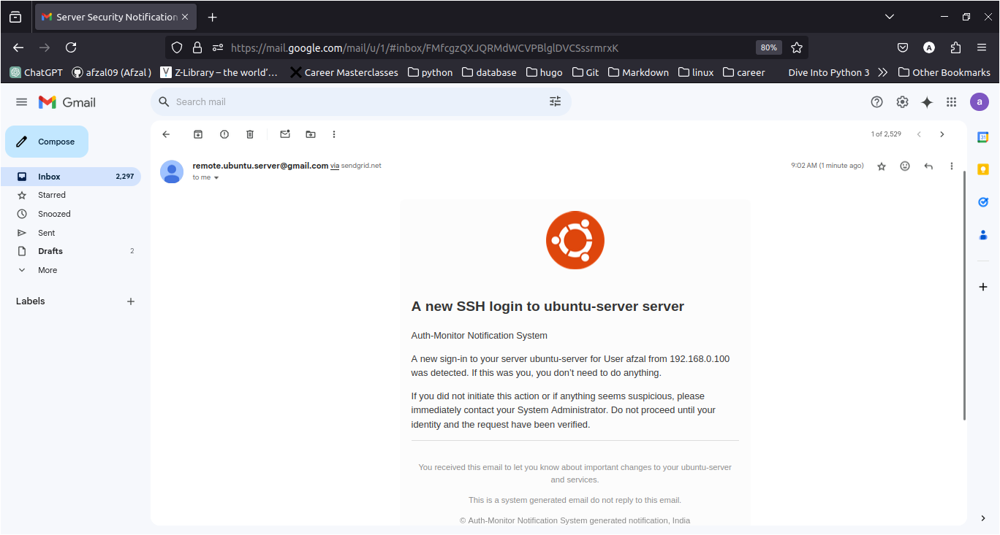
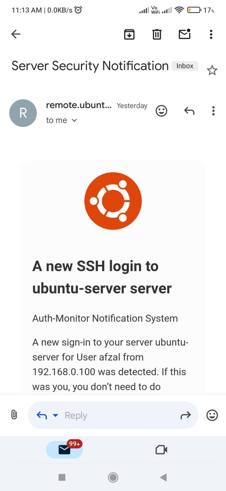

# Auth-Monitor Security Notification System

## Client Details
- **Client Name:** **Afrin Momin**
- **Client Organisation:** **Evonence**
- **Contact No.:** **8983636068**

**Submitted to**
**Computer Science Department**  
**V.P.M’s B.N.Bandodkar College Of Science, Autonomous**  
**2024 – 2025**

---

## Project Overview
**Auth-Monitor Security Notification System** is an Ubuntu-based real-time automated authentication logs monitoring and notification system. It is designed to enhance server security by providing:
- Real-time alerts.
- Detailed monitoring of authentication events.
- Automated processes for timely notifications and efficient management of remote connections.

---

### **Introduction**
The Auth-Monitor Security Notification System addresses the shortcomings of traditional logging methods. By introducing real-time log monitoring and automated notifications, the system ensures timely responses to authentication events and improves overall server security.

### **Current System**
The existing methods for monitoring server authentication logs involve significant limitations:
- **Manual Log Checking:** Delays in identifying potential breaches.
- **No Real-Time Analysis:** Hindering swift responses to unauthorized access.
- **Lack of Automation:** Increasing the risk of overlooking critical incidents.
- **Time-Consuming and Error-Prone:** Reliance on human monitoring can lead to missed events.

#### **Problems Faced:**
- Lack of Real-Time Notifications
- Lack of Automation
- Limited Data Analysis
- High Risk of Human Error
- Slow Response to Incidents

### **Proposed System**
The proposed system introduces a range of features to improve security and monitoring efficiency:
- **Real-Time Log Analysis:** Continuously monitors authentication logs for suspicious activities.
- **Automated Notifications:** Alerts administrators instantly about significant events.
- **Centralized Log Management:** Unified interface for managing logs from multiple servers.
- **Customizable Alert Thresholds:** Enables tailored monitoring based on event severity.
- **Scalability and Flexibility:** Designed for growth across multiple servers.
- **Detailed Reports and Audit Trails:** Ensures compliance and aids forensic investigations.

#### **Key Features:**
- Alerts about different SSH connections.
- Automatic log parsing for pattern detection and anomaly identification.
- Scalable design for evolving organizational needs.
- Supports tailored alert thresholds for efficient security management.

---

## Screenshots
### On Start

### Email Check

### Input Handling: No

### Input Handling: Yes

### SSH Authentication

### Sudo Authentication

### Email Notification Example

### Header Example

### Full Message Example

### Footer Message

---

## System Requirements
### **Software Requirements:**
- **Operating System:** Ubuntu Servers 20.04 LTS or newer
- **Client:** Gmail or any mail software
- **Front-end:** HTML, CSS, JavaScript, AMP Email
- **Back-end:** Python 3.11 with the following packages:
  - `Tailer`
  - `python-dotenv`
  - `sendgrid`
  - `pyinstaller`

### **Hardware Requirements:**
- **Processor:** x64-based processor
- **Network Interface:** Ethernet or Wi-Fi for network communication
- **Hard Disk:** Minimum 256 GB
- **Memory:** Minimum 4 GB RAM

---

## About the Author
**Submitted by:** Afzal Momin  
**PRN:** 2022420159
